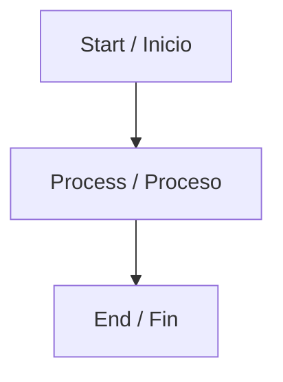

# Bilingual Documentation Pipeline - Quick Start

## Overview

The Finanzas SD project includes an automated bilingual documentation generation pipeline that creates professional PDF and DOCX files from Markdown sources with corporate branding.

## Quick Start

### Local Generation

```bash
# Install dependencies
npm ci

# Generate documentation with default branding (Ikusi)
npm run render-docs

# Generate documentation with CVDex branding
USE_CVDEX_BRANDING=true npm run render-docs
```

### Via GitHub Actions

1. Navigate to the **Actions** tab in GitHub
2. Select **"Documentation Generator - Bilingual Pipeline"**
3. Click **"Run workflow"**
4. Select **main** branch
5. Click **"Run workflow"** to start

Generated files will be committed to `public/docs/latest/` automatically.

## Features

✅ **Dual-format Output**: Both PDF and DOCX for each document  
✅ **Bilingual Support**: Preserves Spanish and English content  
✅ **Corporate Branding**: CVDex or Ikusi branding (configurable)  
✅ **Diagram Rendering**: Converts Mermaid (.mmd) to SVG  
✅ **Professional Styling**: Branded cover pages, headers, footers  
✅ **Easy Navigation**: Generated index.html for browsing  

## Prerequisites

### For Local Development

- Node.js >= 18.18
- npm >= 9
- **Pandoc** (for document conversion)
  - Ubuntu/Debian: `sudo apt-get install pandoc texlive-xetex`
  - macOS: `brew install pandoc basictex`
  - Windows: Download from https://pandoc.org/
- **LaTeX** (for PDF generation)
  - Included with texlive-xetex on Linux
  - BasicTeX on macOS
  - MiKTeX or TeX Live on Windows

### For GitHub Actions

All prerequisites are automatically installed by the workflow.

## Directory Structure

```
docs/                      # Source Markdown files (bilingual)
├── architecture/          # Architecture documentation
├── sops/                  # Standard Operating Procedures
└── ...

diagrams/                  # Diagram source files
├── *.mmd                  # Mermaid diagrams
├── *.drawio               # Draw.io diagrams
└── *.svg                  # SVG images

assets/
├── logo/                  # Brand logos
│   ├── cvdex-logo.svg
│   └── ikusi-logo.svg
└── branding/              # Templates and styles
    ├── template.tex       # LaTeX PDF template
    ├── reference.docx     # DOCX style reference
    └── styles.css         # CSS for HTML

public/docs/latest/        # Generated output (committed)
├── index.html             # Navigation index
├── *.pdf                  # Generated PDFs
└── *.docx                 # Generated DOCXs
```

## Writing Documentation

### Markdown Files

Create bilingual Markdown files in `docs/`:

```markdown
# Document Title

**English Title / Título en Español**

---

## EN: Section in English

Content in English goes here...

## ES: Sección en Español

El contenido en español va aquí...

---
```

### Mermaid Diagrams

Create `.mmd` files in `diagrams/`:



Reference in Markdown:

```markdown

```

## Branding Configuration

### Environment Variable

Set `USE_CVDEX_BRANDING` to control which branding is used:

- `USE_CVDEX_BRANDING=true` → CVDex branding
- `USE_CVDEX_BRANDING=false` or unset → Ikusi branding (default)

### GitHub Repository Variable

To set the default for GitHub Actions:

1. Go to **Settings** → **Secrets and variables** → **Variables**
2. Click **New repository variable**
3. Name: `USE_CVDEX_BRANDING`
4. Value: `true` or `false`
5. Click **Add variable**

## Output Files

Generated files are stored in `public/docs/latest/`:

- **index.html** - Navigation index with links to all documents
- **{name}.pdf** - PDF version with branded cover, headers, footers
- **{name}.docx** - DOCX version with corporate styles

### Accessing Documentation

- **Via Repository**: Browse `public/docs/latest/` in GitHub
- **Via Browser**: Open `public/docs/latest/index.html`
- **Via Download**: Download from GitHub Actions artifacts

## Workflow Details

The GitHub Actions workflow:

1. ✅ Runs **manually only** (workflow_dispatch)
2. ✅ Restricted to **main branch**
3. ✅ Installs Pandoc, LaTeX, and Mermaid CLI
4. ✅ Processes diagrams and documentation
5. ✅ Generates PDF and DOCX files
6. ✅ Commits to `public/docs/latest/` with `[skip ci]`
7. ✅ Creates downloadable artifacts

## Troubleshooting

### Pandoc Not Found

**Error**: `Pandoc is not installed`

**Solution**: Install Pandoc for your platform (see Prerequisites above)

### LaTeX Errors

**Error**: PDF generation fails with LaTeX errors

**Solution**: Install complete LaTeX distribution:
```bash
# Ubuntu/Debian
sudo apt-get install texlive-xetex texlive-fonts-recommended texlive-latex-extra

# macOS  
brew install --cask mactex
```

### Mermaid Rendering Fails

**Error**: Diagram conversion fails

**Solution**: Ensure Chromium is available:
```bash
# Ubuntu/Debian
sudo apt-get install chromium-browser

# Set environment variable
export PUPPETEER_EXECUTABLE_PATH=/usr/bin/chromium-browser
```

### Unicode Issues

**Error**: Special characters appear as "�"

**Solution**: 
- Ensure files are UTF-8 encoded
- Use xelatex engine (already configured)
- Install font packages

## Advanced Topics

For detailed information, see:

- **Full Documentation**: `scripts/docs/README.md`
- **LaTeX Template**: `docs/corporate/branding/template.tex`
- **DOCX Template**: `docs/corporate/branding/reference-docx-instructions.md`
- **Workflow Configuration**: `.github/workflows/docs-generator.yml`
- **Rendering Script**: `scripts/docs/render-docs.ts`

## Security & Compliance

✅ **No Secrets Required**: Pipeline does not need AWS credentials  
✅ **OIDC Ready**: If cloud access needed, uses GitHub OIDC  
✅ **Scope Limited**: Only modifies `public/docs/latest/`  
✅ **Audit Trail**: Git commits provide version history  
✅ **Follows R1 Guardrails**: Adheres to project security standards  

## Support

For issues or questions:

1. Check troubleshooting section above
2. Review `scripts/docs/README.md`
3. Check GitHub Actions logs
4. Open an issue with error details

---

**Last Updated**: November 2024  
**Status**: Active  
**Maintainers**: Finanzas SD Team
