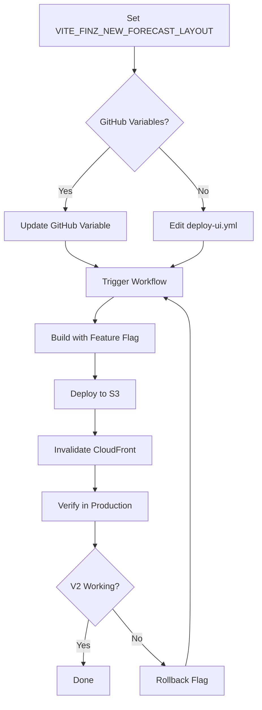

# Feature Flag Configuration for SDMTForecastV2

## Overview

This document describes the feature flag process for enabling/disabling the SDMTForecastV2 Executive Dashboard in production and development environments.

## Feature Flag: `VITE_FINZ_NEW_FORECAST_LAYOUT`

### Purpose
Controls the visibility and availability of the SDMTForecastV2 component, which provides an executive dashboard view with:
- 5-position modular layout
- Real API data integration
- Enhanced KPI visualizations
- Monthly budget management
- Advanced forecast grid with 12-month paging

### Current Status
✅ **ENABLED in Production** (deploy-ui.yml line 39)
```yaml
VITE_FINZ_NEW_FORECAST_LAYOUT: ${{ vars.VITE_FINZ_NEW_FORECAST_LAYOUT || 'true' }}
```

## Configuration Locations

### 1. GitHub Workflow (Production Deployment)
**File**: `.github/workflows/deploy-ui.yml`

**Global Environment** (lines 18-56):
```yaml
env:
  # Forecast UI feature flags - ensure deterministic builds with explicit defaults
  VITE_FINZ_NEW_FORECAST_LAYOUT: ${{ vars.VITE_FINZ_NEW_FORECAST_LAYOUT || 'true' }}
```

**Build Step** (line 242):
```yaml
env:
  VITE_FINZ_NEW_FORECAST_LAYOUT: ${{ env.VITE_FINZ_NEW_FORECAST_LAYOUT }}
```

### 2. Feature Flags Module
**File**: `src/config/featureFlags.ts` (lines 36-49)

```typescript
export const FEATURE_FLAGS = {
  /**
   * Enable Forecast V2 (Pronóstico V2)
   * 
   * When enabled, shows the Pronóstico V2 navigation item and enables
   * the /sdmt/cost/forecast-v2 route with the new SDMTForecastV2 component.
   */
  USE_FORECAST_V2: import.meta.env.VITE_FINZ_NEW_FORECAST_LAYOUT === 'true',
} as const;
```

### 3. Navigation Component
**File**: `src/components/Navigation.tsx` (lines 386, 401)

```typescript
// Filter forecastV2 based on feature flag
if (item.path === "/sdmt/cost/forecast-v2" && !FEATURE_FLAGS.USE_FORECAST_V2) {
  return false;
}

// Also filters by item.id
if (item.id === "forecastV2" && !FEATURE_FLAGS.USE_FORECAST_V2) {
  return false;
}
```

### 4. App Routing
**File**: `src/App.tsx` (lines 213-215)

```typescript
{FEATURE_FLAGS.USE_FORECAST_V2 && (
  <Route path="/sdmt/cost/forecast-v2" element={<SDMTForecastV2 />} />
)}
```

### 5. Environment Files

**Development**: `.env.development` or `.env.local`
```bash
VITE_FINZ_NEW_FORECAST_LAYOUT=true
```

**Production Example**: `.env.example` (line 54)
```bash
VITE_FINZ_NEW_FORECAST_LAYOUT=true
```

## How to Enable/Disable

### In Production (GitHub Deployment)

#### Method 1: Using GitHub Variables (Recommended)
1. Go to GitHub repository → Settings → Secrets and variables → Actions → Variables
2. Create or update variable: `VITE_FINZ_NEW_FORECAST_LAYOUT`
3. Set value to `true` (enable) or `false` (disable)
4. Trigger deployment via push to main or manual workflow_dispatch

#### Method 2: Direct YAML Edit
1. Edit `.github/workflows/deploy-ui.yml` line 39
2. Change default value:
   ```yaml
   # Enable V2
   VITE_FINZ_NEW_FORECAST_LAYOUT: ${{ vars.VITE_FINZ_NEW_FORECAST_LAYOUT || 'true' }}
   
   # Disable V2 (revert to V1)
   VITE_FINZ_NEW_FORECAST_LAYOUT: ${{ vars.VITE_FINZ_NEW_FORECAST_LAYOUT || 'false' }}
   ```
3. Commit and push to main branch

### In Development

#### Method 1: .env.local File (Recommended)
Create/edit `.env.local`:
```bash
# Enable V2
VITE_FINZ_NEW_FORECAST_LAYOUT=true

# Disable V2 (use V1)
VITE_FINZ_NEW_FORECAST_LAYOUT=false
```

#### Method 2: Command Line
```bash
# Enable V2
VITE_FINZ_NEW_FORECAST_LAYOUT=true npm run dev

# Disable V2
VITE_FINZ_NEW_FORECAST_LAYOUT=false npm run dev
```

#### Method 3: .env.development File
Edit `.env.development`:
```bash
VITE_FINZ_NEW_FORECAST_LAYOUT=true
```

## Testing the Feature Flag

### 1. Verify Flag is Active
In browser console (development mode):
```javascript
// Should log feature flag state
// Look for: [FeatureFlags] Loaded configuration: { USE_FORECAST_V2: true }
```

### 2. Check Navigation Visibility
- **When enabled**: "Pronóstico SDMT — Vista Ejecutiva" appears in navigation
- **When disabled**: Only "Gestión de Pronóstico" (V1) appears

### 3. Check Route Accessibility
- **When enabled**: `/sdmt/cost/forecast-v2` route is accessible
- **When disabled**: Route returns 404 or redirects

### 4. Verify Build Artifacts
Check that the flag is correctly embedded in build:
```bash
# Build and check
BUILD_TARGET=finanzas VITE_FINZ_NEW_FORECAST_LAYOUT=true npm run build:finanzas

# Verify in output
grep -r "USE_FORECAST_V2" dist-finanzas/assets/*.js
```

## Rollback Procedure

### Emergency Rollback (Production)

If V2 causes issues in production:

1. **Quick Fix via GitHub Variables**:
   - Set `VITE_FINZ_NEW_FORECAST_LAYOUT=false` in GitHub variables
   - Trigger new deployment
   - ETA: 5-10 minutes

2. **Immediate Fix via CloudFront**:
   - If previous deployment is cached, create CloudFront invalidation
   - Invalidate paths: `/finanzas/*`
   - Users will get new build on next page load

3. **Verify Rollback**:
   - Check navigation no longer shows V2 option
   - Confirm `/sdmt/cost/forecast-v2` returns 404
   - Verify V1 (`/sdmt/cost/forecast`) still works

## Deployment Workflow

### Full Feature Flag Deployment Process



## Monitoring

### Key Metrics to Monitor

When V2 is enabled, monitor:
- **Page Load Time**: Should be similar to V1
- **API Call Volume**: V2 makes additional calls for baseline data
- **Error Rates**: Watch for 404s on budget endpoints
- **User Engagement**: Track usage of V2 vs V1 routes

### Error Scenarios

| Error | Possible Cause | Solution |
|-------|---------------|----------|
| V2 route returns 404 | Flag not enabled in build | Check build logs, verify env var |
| V2 navigation missing | Flag filtered in Navigation.tsx | Verify FEATURE_FLAGS.USE_FORECAST_V2 |
| Build fails with V2 | TypeScript errors in SDMTForecastV2 | Check console, fix imports |
| V2 shows no data | API endpoints not accessible | Verify VITE_API_BASE_URL |

## Related Documentation

- `SDMTFORECASTV2_REAL_API_INTEGRATION.md` - V2 API integration details
- `IMPLEMENTATION_SUMMARY_FORECAST_V2.md` - V2 implementation summary
- `.env.example` - Environment variable examples
- `src/config/featureFlags.ts` - Feature flag definitions

## Troubleshooting

### Feature Flag Not Taking Effect

1. **Check build was rebuilt**:
   ```bash
   # Feature flags are embedded at build time
   # Changing .env requires rebuild
   npm run build:finanzas
   ```

2. **Verify environment variable is set**:
   ```bash
   echo $VITE_FINZ_NEW_FORECAST_LAYOUT
   # Should output: true or false
   ```

3. **Check browser console**:
   - Look for: `[FeatureFlags] Loaded configuration: ...`
   - Verify `USE_FORECAST_V2` value

4. **Clear browser cache**:
   - Hard refresh: Ctrl+Shift+R (Windows) or Cmd+Shift+R (Mac)
   - Or clear site data in DevTools

### V2 Shows in Dev but Not Production

1. **Check deploy-ui.yml has correct default**:
   ```yaml
   VITE_FINZ_NEW_FORECAST_LAYOUT: ${{ vars.VITE_FINZ_NEW_FORECAST_LAYOUT || 'true' }}
   ```

2. **Verify GitHub variable is set** (if using variables method)

3. **Check build logs** for environment variable values

4. **Verify CloudFront invalidation completed**

## Best Practices

1. ✅ **Use GitHub Variables for production** - Easier to toggle without code changes
2. ✅ **Use .env.local for development** - Keeps personal config separate
3. ✅ **Test flag toggle in staging first** - Before changing production
4. ✅ **Monitor after enabling** - Watch for errors and performance issues
5. ✅ **Document reason for changes** - Add comment when toggling
6. ✅ **Keep V1 working** - Don't break existing forecast while V2 is in rollout

## Support

For issues with feature flags:
1. Check this document first
2. Verify environment variables in build logs
3. Test flag toggle in development
4. Review related documentation above
5. Check browser console for feature flag logs

---

**Last Updated**: January 29, 2026
**Feature Status**: ✅ Enabled in Production
**Default Value**: `true` (V2 enabled)
