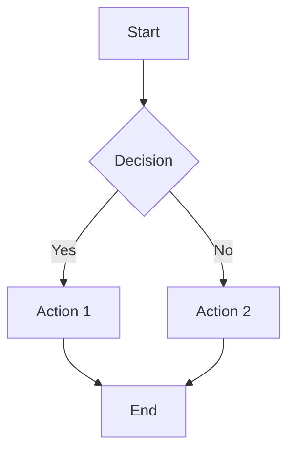
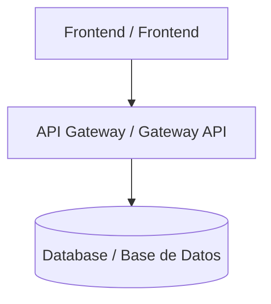
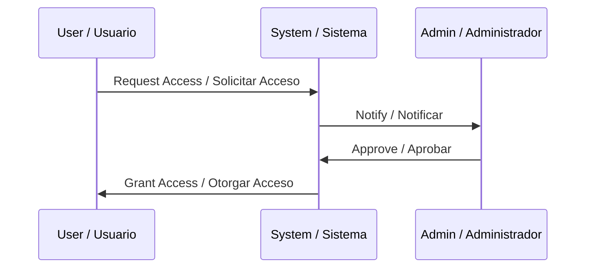

# Diagrams Directory

This directory contains source diagram files used in the Finanzas SD documentation.

## Supported Formats

### Mermaid Diagrams (.mmd)
Mermaid diagrams are automatically converted to SVG during the documentation build process.

**Example Mermaid diagram:**


**Creating Mermaid diagrams:**
1. Create a `.mmd` file in this directory
2. Write your diagram using Mermaid syntax
3. The render-docs script will automatically convert it to SVG
4. Reference in Markdown: ``

**Mermaid Documentation**: https://mermaid.js.org/

### Draw.io Diagrams (.drawio)
Draw.io diagrams require manual export to SVG before they can be used in documentation.

**Creating Draw.io diagrams:**
1. Create diagram at https://app.diagrams.net/
2. Save as `.drawio` file in this directory
3. **Export to SVG**: File → Export as → SVG
4. Save SVG in this directory with same base name
5. Reference in Markdown: ``

**Note**: Automated Draw.io conversion is not yet implemented. Manual export is required.

### SVG Images (.svg)
SVG images can be used directly without conversion.

**Using SVG images:**
1. Place SVG file in this directory
2. Reference in Markdown: ``

## Naming Conventions

- Use kebab-case for file names: `system-architecture.mmd`
- Use descriptive names: `data-flow-diagram.mmd` not `diagram1.mmd`
- Match diagram name with content
- Keep names consistent between source and output formats

## Bilingual Diagrams

For bilingual documentation, consider:

1. **Bilingual Labels**: Include both languages in diagram text
   ```
   Start / Inicio
   Process / Proceso
   End / Fin
   ```

2. **Separate Diagrams**: Create separate versions for each language
   ```
   system-architecture-en.mmd
   system-architecture-es.mmd
   ```

3. **Language-Neutral**: Use symbols and minimal text
   ```
   Use icons and arrows with minimal text labels
   ```

## Examples

### Example: System Architecture Diagram (Mermaid)

File: `system-architecture.mmd`



### Example: Process Flow (Mermaid)

File: `user-onboarding-flow.mmd`



## Current Diagrams

- `system-architecture.mmd` - High-level system architecture showing main components

## Future Enhancements

- [ ] Automated Draw.io to SVG conversion
- [ ] PlantUML support
- [ ] Graphviz DOT file support
- [ ] Automatic bilingual diagram generation
- [ ] Diagram validation and linting

## Contributing

When adding new diagrams:

1. Place source file in this directory
2. Use descriptive file names
3. Include bilingual labels where applicable
4. Reference diagram in relevant documentation
5. Test diagram rendering in generated PDFs/DOCXs

## Tools

- **Mermaid Live Editor**: https://mermaid.live/
- **Draw.io**: https://app.diagrams.net/
- **Mermaid CLI**: Installed automatically by documentation pipeline

## Support

For questions about diagram creation or issues with rendering:
- See `scripts/docs/README.md` for technical details
- Check Mermaid documentation for syntax help
- Contact documentation team for assistance
