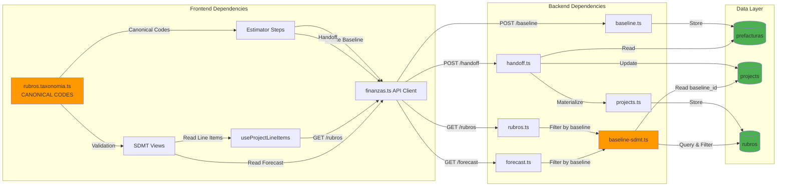

# Comprehensive End-to-End Data Lineage
## Financial Planning System: Complete Data Flow Architecture

> **Follow-up to PR #574**: This document validates cross-impacting and interconnected pieces of the overall data lineage, showing how files under `src/` interact with `services/finanzas-api`, what role each file serves, and the impact on the UI.

---

## Table of Contents

1. [Executive Summary](#executive-summary)
2. [Architecture Overview](#architecture-overview)
3. [Data Flow Tree (End-to-End)](#data-flow-tree-end-to-end)
4. [Frontend (src/) Components](#frontend-src-components)
5. [Backend (services/finanzas-api) Handlers](#backend-servicesfinanzas-api-handlers)
6. [Cross-Impacting Data Lineage](#cross-impacting-data-lineage)
7. [UI Impact Analysis](#ui-impact-analysis)
8. [Critical Integration Points](#critical-integration-points)
9. [Issues Identified & Corrections](#issues-identified--corrections)

---

## Executive Summary

The Financial Planning system implements a **complete data lineage** from project estimation through baseline creation to service delivery cost management. Data flows through three major stages:

1. **PMO Estimator** → Creates baseline with canonical rubros taxonomy
2. **Baseline Handoff** → Materializes rubros in DynamoDB with baseline filtering
3. **SDMT Cost Management** → Views filtered rubros for planning, forecasting, and actuals

**Key Principle**: All data is filtered by `baseline_id` to prevent mixing multiple baselines and ensure consistency from Estimator → SDMT.

---

## Architecture Overview

```mermaid
graph TB
    subgraph "Frontend Layer (src/)"
        UI_EST[PMO Estimator UI<br/>src/features/pmo/prefactura/Estimator/]
        UI_SDMT[SDMT Cost Management UI<br/>src/features/sdmt/cost/]
        API_CLIENT[API Client<br/>src/api/finanzas.ts]
        HOOKS[React Hooks<br/>src/hooks/useProjectLineItems.ts]
        TAXONOMY[Rubros Taxonomy<br/>src/modules/rubros.taxonomia.ts]
    end
    
    subgraph "API Gateway Layer"
        APIGW[API Gateway<br/>AWS Lambda Functions]
    end
    
    subgraph "Backend Layer (services/finanzas-api/)"
        H_BASELINE[Baseline Handler<br/>handlers/baseline.ts]
        H_HANDOFF[Handoff Handler<br/>handlers/handoff.ts]
        H_PROJECTS[Projects Handler<br/>handlers/projects.ts]
        H_RUBROS[Rubros Handler<br/>handlers/rubros.ts]
        H_FORECAST[Forecast Handler<br/>handlers/forecast.ts]
        LIB_SDMT[Baseline-SDMT Library<br/>lib/baseline-sdmt.ts]
        LIB_TAX[Canonical Taxonomy<br/>lib/canonical-taxonomy.ts]
    end
    
    subgraph "Data Layer"
        DDB_PREF[(DynamoDB: prefacturas<br/>Baseline Storage)]
        DDB_PROJ[(DynamoDB: projects<br/>Project Metadata)]
        DDB_RUB[(DynamoDB: rubros<br/>Line Items)]
    end
    
    UI_EST -->|1. Create Baseline| API_CLIENT
    API_CLIENT -->|POST /baseline| APIGW
    APIGW --> H_BASELINE
    H_BASELINE --> DDB_PREF
    
    UI_EST -->|2. Handoff to SDMT| API_CLIENT
    API_CLIENT -->|POST /projects/{id}/handoff| APIGW
    APIGW --> H_HANDOFF
    H_HANDOFF --> DDB_PROJ
    H_HANDOFF -->|Materialize Rubros| H_PROJECTS
    H_PROJECTS --> DDB_RUB
    
    UI_SDMT -->|3. Load Line Items| HOOKS
    HOOKS -->|getProjectRubros| API_CLIENT
    API_CLIENT -->|GET /projects/{id}/rubros| APIGW
    APIGW --> H_RUBROS
    H_RUBROS --> LIB_SDMT
    LIB_SDMT -->|Filter by baseline_id| DDB_RUB
    
    UI_SDMT -->|4. Load Forecast| HOOKS
    HOOKS -->|API Call| API_CLIENT
    API_CLIENT -->|GET /plan/forecast| APIGW
    APIGW --> H_FORECAST
    H_FORECAST --> LIB_SDMT
    
    TAXONOMY -.->|Canonical Codes| UI_EST
    TAXONOMY -.->|Canonical Codes| UI_SDMT
    LIB_TAX -.->|Validation| H_RUBROS
    
    style UI_EST fill:#e3f2fd
    style UI_SDMT fill:#e3f2fd
    style H_BASELINE fill:#fff3e0
    style H_HANDOFF fill:#fff3e0
    style H_PROJECTS fill:#fff3e0
    style DDB_PREF fill:#e8f5e9
    style DDB_PROJ fill:#e8f5e9
    style DDB_RUB fill:#e8f5e9
```

---

## Data Flow Tree (End-to-End)

```
📦 Financial Planning System Data Lineage
│
├─── 1️⃣ ESTIMATION PHASE (PMO)
│    │
│    ├── Frontend Components (src/)
│    │   ├── src/features/pmo/prefactura/Estimator/
│    │   │   ├── PMOEstimatorWizard.tsx ..................... [Orchestrates 5-step wizard]
│    │   │   └── steps/
│    │   │       ├── DealInputsStep.tsx .................... [Captures: project name, client, dates, currency]
│    │   │       ├── LaborStep.tsx ......................... [Captures: MOD roles with canonical rubroIds]
│    │   │       ├── NonLaborStep.tsx ...................... [Captures: Non-labor with canonical rubroIds]
│    │   │       ├── FXIndexationStep.tsx .................. [Captures: FX rates, indexation]
│    │   │       └── ReviewSignStep.tsx .................... [Digital signature & submission]
│    │   │
│    │   ├── src/modules/rubros.taxonomia.ts ............... [Canonical rubros taxonomy - SINGLE SOURCE OF TRUTH]
│    │   │   └── CATALOGO_RUBROS[] ......................... [MOD-ING, MOD-LEAD, GSV-REU, etc.]
│    │   │
│    │   └── src/api/finanzas.ts ........................... [API client: createBaseline()]
│    │
│    ├── API Layer
│    │   └── POST /baseline ................................ [Creates baseline with canonical rubroIds]
│    │
│    ├── Backend Handlers (services/finanzas-api/src/)
│    │   └── handlers/baseline.ts .......................... [Stores baseline in prefacturas table]
│    │       └── Payload Structure:
│    │           {
│    │             project_name, client_name, start_date, duration_months,
│    │             labor_estimates: [{ rubroId: "MOD-LEAD", role, rate, ... }],
│    │             non_labor_estimates: [{ rubroId: "GSV-REU", category, amount, ... }]
│    │           }
│    │
│    └── Data Storage
│        └── DynamoDB: prefacturas
│            ├── PK: PROJECT#{projectId}
│            ├── SK: BASELINE#{baselineId}
│            └── Attributes: labor_estimates[], non_labor_estimates[], project metadata
│
├─── 2️⃣ HANDOFF PHASE (PMO → SDMT)
│    │
│    ├── Frontend Trigger
│    │   └── ReviewSignStep.tsx ............................ [Calls handoffToSDMT()]
│    │       └── src/api/finanzas.ts ....................... [handoffBaseline(projectId, baselineId)]
│    │
│    ├── API Layer
│    │   └── POST /projects/{projectId}/handoff ............ [Handoff baseline to SDMT]
│    │
│    ├── Backend Handlers (services/finanzas-api/src/)
│    │   ├── handlers/handoff.ts ........................... [Orchestrates handoff process]
│    │   │   ├── 1. Fetch baseline from prefacturas
│    │   │   ├── 2. Update project metadata with baseline_id
│    │   │   ├── 3. Generate short project code (P-xxxxxxxx)
│    │   │   ├── 4. Calculate end_date from start_date + duration_months
│    │   │   └── 5. Call generateLineItems() to materialize rubros
│    │   │
│    │   └── handlers/projects.ts .......................... [generateLineItems()]
│    │       └── Materializes each estimate as DynamoDB rubro:
│    │           {
│    │             PK: PROJECT#{projectId}
│    │             SK: RUBRO#{lineaCodigo}#{baselineId}#{index}
│    │             rubroId: "MOD-LEAD#base_abc123#1",
│    │             nombre: "Ingeniero Delivery",
│    │             metadata: {
│    │               baseline_id: "base_abc123",        ← CRITICAL FOR FILTERING
│    │               linea_codigo: "MOD-LEAD",          ← CANONICAL CODE
│    │               source: "baseline"
│    │             }
│    │           }
│    │
│    └── Data Storage
│        ├── DynamoDB: projects
│        │   ├── PK: PROJECT#{projectId}
│        │   ├── SK: METADATA
│        │   └── Attributes:
│        │       ├── baseline_id: "base_abc123" ........... ← ACTIVE BASELINE REFERENCE
│        │       ├── baseline_status: "handed_off"
│        │       ├── code: "P-5ae50ace"
│        │       ├── name, client, start_date, end_date
│        │       └── duration_months
│        │
│        └── DynamoDB: rubros
│            ├── PK: PROJECT#{projectId}
│            ├── SK: RUBRO#{lineaCodigo}#{baselineId}#{index}
│            └── Attributes: All rubro fields + metadata.baseline_id
│
├─── 3️⃣ SDMT COST MANAGEMENT PHASE
│    │
│    ├── Frontend Components (src/)
│    │   ├── src/features/sdmt/cost/
│    │   │   ├── Catalog/SDMTCatalog.tsx ................... [WRITES: Add/edit/delete rubros]
│    │   │   │   ├── Uses: useProjectLineItems() .......... [Read rubros]
│    │   │   │   └── Calls: addProjectRubro() ............. [Create new rubro]
│    │   │   │
│    │   │   ├── Forecast/SDMTForecast.tsx ................. [READS: P/F/A grid visualization]
│    │   │   │   └── Uses: API call to /plan/forecast
│    │   │   │
│    │   │   ├── Changes/SDMTChanges.tsx ................... [READS: Change requests view]
│    │   │   │   └── Uses: useProjectLineItems()
│    │   │   │
│    │   │   ├── Reconciliation/SDMTReconciliation.tsx ..... [READS: Reconciliation view]
│    │   │   │   └── Uses: useProjectLineItems()
│    │   │   │
│    │   │   └── Cashflow/SDMTCashflow.tsx ................. [READS: Cashflow visualization]
│    │   │
│    │   ├── src/hooks/useProjectLineItems.ts .............. [React Query hook for line items]
│    │   │   └── Calls: getProjectRubros(projectId)
│    │   │
│    │   └── src/api/finanzas.ts ........................... [API client functions]
│    │       ├── getProjectRubros() ........................ [GET /projects/{id}/rubros]
│    │       └── addProjectRubro() ......................... [POST /projects/{id}/rubros]
│    │
│    ├── API Layer
│    │   ├── GET /projects/{projectId}/rubros .............. [Fetch rubros for catalog]
│    │   ├── POST /projects/{projectId}/rubros ............. [Add rubro to catalog]
│    │   └── GET /plan/forecast ............................ [Fetch forecast grid]
│    │
│    ├── Backend Handlers (services/finanzas-api/src/)
│    │   ├── handlers/rubros.ts ............................ [GET handler for rubros]
│    │   │   └── Calls: queryProjectRubros(projectId)
│    │   │
│    │   ├── handlers/forecast.ts .......................... [GET handler for forecast]
│    │   │   ├── Calls: queryProjectRubros(projectId)
│    │   │   └── Generates: P/F/A grid from baseline-filtered rubros
│    │   │
│    │   └── lib/baseline-sdmt.ts .......................... [CRITICAL FILTERING LIBRARY]
│    │       ├── getProjectActiveBaseline(projectId) ....... [Reads baseline_id from projects.METADATA]
│    │       ├── filterRubrosByBaseline(rubros, baselineId) [Filters by metadata.baseline_id]
│    │       └── queryProjectRubros(projectId) ............. [Query + filter in one call]
│    │           └── Process:
│    │               1. Query all rubros: PK=PROJECT#{projectId}, SK begins_with RUBRO#
│    │               2. Get active baseline_id from project metadata
│    │               3. Filter: only return rubros where metadata.baseline_id matches
│    │               4. Result: Clean, non-mixed rubro list for SDMT
│    │
│    └── Data Reads
│        ├── DynamoDB: projects (read baseline_id)
│        └── DynamoDB: rubros (read & filter by baseline_id)
│
└─── 4️⃣ UI RENDERING & DISPLAY
     │
     ├── Project Selection & Context
     │   ├── src/contexts/ProjectContext.tsx ............... [Global project state]
     │   └── src/modules/finanzas/projects/useProjects.ts .. [Project data hook]
     │
     ├── Display Utilities
     │   └── src/lib/projects/
     │       ├── formatLabel.ts ............................ [Format project labels consistently]
     │       │   ├── formatProjectLabel() .................. ["P-5ae50ace – Mobile App"]
     │       │   └── formatProjectLabelWithClient() ........ ["P-5ae50ace – Mobile App (ACME)"]
     │       └── display.ts ................................ [getProjectDisplay() helper]
     │
     └── UI Components
         ├── Project Dropdowns .............................. [Shows: code + name + client]
         ├── SDMT Catalog Table ............................. [Shows: filtered rubros by baseline]
         ├── SDMT Forecast Grid ............................. [Shows: P/F/A by month]
         └── SDMT Changes/Reconciliation .................... [Shows: baseline-filtered data]
```

---

## Frontend (src/) Components

### 1. PMO Estimator Module

**Location**: `src/features/pmo/prefactura/Estimator/`

#### `PMOEstimatorWizard.tsx`
- **Role**: Main orchestrator for the 5-step estimation wizard
- **Impact**: Entry point for baseline creation
- **Data Flow**: Collects user inputs → passes to each step component → submits to backend

#### Step Components

##### `DealInputsStep.tsx`
- **Role**: Captures project metadata (Step 1/5)
- **Collects**:
  - `project_name`: Human-readable project name
  - `client_name`: Client/customer name
  - `start_date`: Project start date (YYYY-MM-DD)
  - `duration_months`: Project duration (1-60 months)
  - `currency`: Project currency (USD, COP, etc.)
  - `contract_value`: Total contract value
- **UI Impact**: These fields populate project metadata in SDMT views
- **Data Lineage**: → `handlers/baseline.ts` → `prefacturas` table → `handlers/handoff.ts` → `projects` table

##### `LaborStep.tsx`
- **Role**: Captures labor (MOD) estimates (Step 2/5)
- **Critical Function**: Maps display roles → canonical `rubroId` using taxonomy
- **Example Mapping**:
  ```typescript
  "Ingeniero Delivery" → rubroId: "MOD-LEAD"
  "Ingeniero Soporte N2" → rubroId: "MOD-ING"
  "Service Delivery Manager" → rubroId: "MOD-SDM"
  ```
- **Collects Per Role**:
  - `rubroId`: Canonical taxonomy code (e.g., "MOD-LEAD")
  - `role`: Display name (e.g., "Ingeniero Delivery")
  - `level`: Seniority level (junior/mid/senior)
  - `country`: Location for rate calculation
  - `fte_count`: Number of FTEs
  - `hourly_rate`: Base hourly rate
  - `on_cost_percentage`: On-costs percentage
  - `start_month`, `end_month`: Duration within project
- **UI Impact**: These rubros appear in SDMT Catalog filtered by baseline
- **Data Lineage**: → `baseline.labor_estimates[]` → materialized as DynamoDB rubros with `metadata.linea_codigo = "MOD-LEAD"`

##### `NonLaborStep.tsx`
- **Role**: Captures non-labor estimates (Step 3/5)
- **Critical Function**: Stores canonical `rubroId` from taxonomy dropdown
- **Example Mapping**:
  ```typescript
  "Reuniones de seguimiento" → rubroId: "GSV-REU"
  "Infraestructura AWS" → rubroId: "SOI-AWS"
  "Capacitación" → rubroId: "CAP-FORM"
  ```
- **Collects Per Item**:
  - `rubroId`: Canonical taxonomy code
  - `category`: Category name from taxonomy
  - `description`: Item description
  - `amount`: Cost amount
  - `vendor`: Optional vendor name
  - `one_time`: Boolean (one-time vs recurring)
  - `start_month`, `end_month`: Duration
- **UI Impact**: Non-labor rubros in SDMT Catalog
- **Data Lineage**: → `baseline.non_labor_estimates[]` → materialized as rubros

##### `FXIndexationStep.tsx`
- **Role**: Captures FX rates and indexation parameters (Step 4/5)
- **Collects**:
  - Currency exchange rates
  - Indexation parameters (CPI, min wage adjustments)
- **UI Impact**: Used for financial calculations, not directly visible in SDMT

##### `ReviewSignStep.tsx`
- **Role**: Final review, digital signature, and submission (Step 5/5)
- **Functions**:
  - Displays summary of all estimates
  - Captures digital signature
  - Submits baseline to backend
  - **Triggers handoff to SDMT**
- **Key API Calls**:
  ```typescript
  1. createBaseline(payload) → POST /baseline
  2. handoffBaseline(projectId, baselineId) → POST /projects/{id}/handoff
  ```
- **UI Impact**: After successful handoff, redirects to SDMT with new project visible

---

### 2. SDMT Cost Management Module

**Location**: `src/features/sdmt/cost/`

#### `Catalog/SDMTCatalog.tsx`
- **Role**: CRUD interface for project rubros (line items catalog)
- **Data Access**: 
  - **READ**: `useProjectLineItems()` → filtered by baseline
  - **WRITE**: `addProjectRubro()` → creates new rubro
- **UI Components**:
  - Rubro table with columns: Category, Description, Unit Cost, Qty, Total
  - Add rubro dialog with Service Tier Selector
  - Edit/delete actions
- **Critical Behavior**: 
  - **ONLY** rubro that writes cost data
  - All other SDMT views are read-only
- **UI Impact**: Direct manipulation of project costs
- **Data Flow**:
  ```
  User clicks "Add" → Dialog opens → Selects rubro → 
  addProjectRubro() → POST /projects/{id}/rubros → 
  handlers/rubros.ts → Stores in DynamoDB → 
  invalidates query → UI refreshes with new rubro
  ```

#### `Forecast/SDMTForecast.tsx`
- **Role**: P/F/A (Planned/Forecast/Actual) grid visualization
- **Data Access**: `GET /plan/forecast?projectId={id}`
- **Display**: Monthly forecast grid with:
  - Rows: Line items (rubros)
  - Columns: Months (1-12 or more)
  - Cells: P/F/A amounts
- **Read-Only**: No mutations
- **UI Impact**: Primary view for cost forecasting and variance tracking

#### `Changes/SDMTChanges.tsx`
- **Role**: View change requests and modifications
- **Data Access**: `useProjectLineItems()` → filtered by baseline
- **Display**: List of proposed changes with approval workflow
- **Read-Only**: Displays data, no direct writes
- **UI Impact**: Change management visibility

#### `Reconciliation/SDMTReconciliation.tsx`
- **Role**: Reconciliation view for planned vs actual costs
- **Data Access**: `useProjectLineItems()` → filtered by baseline
- **Display**: Comparison table with variance analysis
- **Read-Only**: Consumes data
- **UI Impact**: Financial reconciliation and variance reporting

#### `Cashflow/SDMTCashflow.tsx`
- **Role**: Cashflow visualization and analysis
- **Data Access**: API calls for cashflow data
- **Display**: Charts and tables showing cash in/out flows
- **Read-Only**: Visualization only
- **UI Impact**: Financial health monitoring

---

### 3. Shared Frontend Infrastructure

#### `src/api/finanzas.ts`
- **Role**: Central API client for all Finanzas backend interactions
- **Critical Functions**:
  
  ```typescript
  // Baseline Operations
  createBaseline(payload: BaselinePayload): Promise<BaselineResponse>
    → POST /baseline
  
  listPrefacturaBaselines(status?: string): Promise<{ items: BaselineListItem[] }>
    → GET /prefacturas/baselines
  
  // Project Operations
  getProjects(): Promise<ProjectDTO[]>
    → GET /projects
  
  handoffBaseline(projectId: string, baselineId: string): Promise<HandoffResponse>
    → POST /projects/{projectId}/handoff
  
  // Rubros Operations
  getProjectRubros(projectId: string): Promise<LineItem[]>
    → GET /projects/{projectId}/rubros
  
  addProjectRubro(projectId: string, payload: AddProjectRubroInput): Promise<Json>
    → POST /projects/{projectId}/rubros
  
  deleteProjectRubro(projectId: string, rubroId: string): Promise<void>
    → DELETE /projects/{projectId}/rubros/{rubroId}
  
  // Forecast Operations
  getForecast(projectId: string, months?: number): Promise<ForecastResponse>
    → GET /plan/forecast?projectId={projectId}&months={months}
  ```

- **Error Handling**: Centralized error handling with `FinanzasApiError`
- **Auth**: Automatically includes auth headers via `buildAuthHeader()`
- **UI Impact**: All data mutations and fetches go through this client

#### `src/hooks/useProjectLineItems.ts`
- **Role**: React Query hook for fetching and caching project line items
- **Wraps**: `getProjectRubros(projectId)`
- **Provides**:
  ```typescript
  {
    lineItems: LineItem[],         // Filtered by baseline
    isLoading: boolean,
    error: Error | null,
    invalidate: () => Promise<void> // Refetch after mutations
  }
  ```
- **Caching**: 5-minute stale time, 15-minute garbage collection
- **UI Impact**: Consistent data access across all SDMT views

#### `src/modules/rubros.taxonomia.ts`
- **Role**: **SINGLE SOURCE OF TRUTH** for rubros taxonomy
- **Structure**:
  ```typescript
  export const CATALOGO_RUBROS: RubroTaxonomia[] = [
    {
      categoria_codigo: "MOD",
      categoria: "Mano de Obra Directa",
      linea_codigo: "MOD-ING",
      linea_gasto: "Ingenieros de soporte (mensual)",
      descripcion: "Costo mensual de ingenieros...",
      tipo_ejecucion: "mensual",
      tipo_costo: "OPEX"
    },
    // ... 50+ rubros
  ]
  ```
- **Exports**:
  - `CATALOGO_RUBROS`: Full taxonomy array
  - `byLineaCodigo`: Map for quick lookup by code
  - `MOD_ROLE_MAPPING`: Maps rubros to MOD roles
- **UI Impact**: Ensures consistency from Estimator → SDMT
- **Data Lineage**: Frontend taxonomy → backend validation → DynamoDB storage

#### `src/contexts/ProjectContext.tsx`
- **Role**: Global project selection state management
- **Provides**:
  ```typescript
  {
    selectedProject: ProjectDTO | null,
    setSelectedProject: (project: ProjectDTO | null) => void,
    projects: ProjectDTO[],
    loading: boolean
  }
  ```
- **UI Impact**: Single project selection affects all SDMT views

---

## Backend (services/finanzas-api) Handlers

### 1. Baseline & Handoff Handlers

#### `handlers/baseline.ts`
- **Endpoint**: `POST /baseline`
- **Role**: Creates and stores baseline in `prefacturas` table
- **Request Payload**:
  ```typescript
  {
    project_name: string,
    client_name: string,
    start_date: string,
    duration_months: number,
    currency: string,
    labor_estimates: Array<{
      rubroId: string,           // e.g., "MOD-LEAD"
      role: string,
      fte_count: number,
      hourly_rate: number,
      ...
    }>,
    non_labor_estimates: Array<{
      rubroId: string,           // e.g., "GSV-REU"
      category: string,
      amount: number,
      ...
    }>
  }
  ```
- **Process**:
  1. Generate `baselineId`: `base_${uuid().substring(0, 10)}`
  2. Generate `projectId` from project_name (or UUID)
  3. Store in DynamoDB:
     - PK: `PROJECT#{projectId}`
     - SK: `BASELINE#{baselineId}`
     - Full payload stored
  4. Create metadata record:
     - PK: `BASELINE#{baselineId}`
     - SK: `METADATA`
- **Response**:
  ```typescript
  {
    baselineId: string,
    projectId: string,
    status: "PendingSDMT",
    totalAmount: number,
    createdAt: string
  }
  ```
- **UI Impact**: Creates baseline that can be handed off to SDMT

#### `handlers/handoff.ts`
- **Endpoint**: `POST /projects/{projectId}/handoff`
- **Role**: Orchestrates baseline handoff to SDMT
- **Process Flow**:
  ```
  1. Fetch baseline from prefacturas table
  2. Extract project metadata (name, client, dates)
  3. Calculate end_date = start_date + duration_months
  4. Generate short project code (P-xxxxxxxx)
  5. Update/create project in projects table:
     - PK: PROJECT#{projectId}
     - SK: METADATA
     - Store: baseline_id, baseline_status, code, name, client, dates
  6. Call generateLineItems() to materialize rubros
  7. Return enriched handoff response
  ```
- **Critical Fields Set**:
  - `baseline_id`: Links project to baseline (used for filtering)
  - `code`: Short project code for display
  - `client`: Client name for UI display
  - `end_date`: Calculated from start + duration
- **Response** (HTTP 201 Created):
  ```typescript
  {
    handoffId: string,
    projectId: string,
    baselineId: string,
    status: "HandoffComplete",
    projectName: string,
    client: string,
    code: string,
    startDate: string,
    endDate: string,
    durationMonths: number,
    currency: string,
    modTotal: number
  }
  ```
- **UI Impact**: Project becomes visible in SDMT with all metadata populated

#### `handlers/projects.ts`
- **Contains**: `generateLineItems()` function
- **Role**: Materializes baseline estimates as DynamoDB rubros
- **Process Per Labor Estimate**:
  ```typescript
  For each labor_estimate:
    1. Extract rubroId (e.g., "MOD-LEAD")
    2. Calculate monthly cost with on-costs
    3. Create rubro:
       PK: PROJECT#{projectId}
       SK: RUBRO#{rubroId}#{baselineId}#{index}
       Attributes:
         - rubroId: "MOD-LEAD#base_abc123#1"
         - nombre: role name
         - category: "Labor"
         - qty: fte_count
         - unit_cost: monthly cost
         - recurring: true
         - start_month, end_month
         - metadata: {
             baseline_id: "base_abc123",    ← CRITICAL
             linea_codigo: "MOD-LEAD",      ← CANONICAL
             source: "baseline",
             role: "Ingeniero Delivery"
           }
  ```
- **Process Per Non-Labor Estimate**:
  ```typescript
  For each non_labor_estimate:
    1. Extract rubroId (e.g., "GSV-REU")
    2. Create rubro:
       PK: PROJECT#{projectId}
       SK: RUBRO#{rubroId}#{baselineId}#{index}
       Attributes:
         - rubroId: "GSV-REU#base_abc123#1"
         - nombre: description
         - category: category
         - qty: 1
         - unit_cost: amount
         - recurring: !one_time
         - start_month, end_month
         - metadata: {
             baseline_id: "base_abc123",    ← CRITICAL
             linea_codigo: "GSV-REU",       ← CANONICAL
             source: "baseline"
           }
  ```
- **UI Impact**: These rubros appear in all SDMT views (Catalog, Forecast, etc.)

---

### 2. SDMT Data Access Handlers

#### `handlers/rubros.ts`
- **Endpoint**: `GET /projects/{projectId}/rubros`
- **Role**: Fetch rubros for SDMT Catalog and other views
- **Process**:
  ```
  1. Call queryProjectRubros(projectId) from lib/baseline-sdmt.ts
  2. Transform rubros to API response format
  3. Return filtered rubros (only from active baseline)
  ```
- **Response**: Array of rubros with all attributes
- **Critical Behavior**: **ALWAYS filters by baseline_id** to prevent mixing
- **UI Impact**: Provides data for SDMT Catalog table

#### `handlers/forecast.ts`
- **Endpoint**: `GET /plan/forecast?projectId={id}&months={n}`
- **Role**: Generate P/F/A forecast grid
- **Process**:
  ```
  1. Call queryProjectRubros(projectId) ← baseline-filtered
  2. Call generateForecastGrid(rubros, months)
  3. For each rubro:
     - If recurring: spread cost across months (start_month to end_month)
     - If one-time: entire cost in start_month
  4. Layer in allocations (if available)
  5. Layer in payroll actuals (if available)
  6. Return grid: { line_item_id, month, planned, forecast, actual }[]
  ```
- **Response**:
  ```typescript
  {
    data: Array<{
      line_item_id: string,
      month: number,
      planned: number,
      forecast: number,
      actual: number,
      variance: number
    }>,
    projectId: string,
    months: number,
    rubrosCount: number,
    allocationsCount: number,
    payrollCount: number
  }
  ```
- **UI Impact**: Powers SDMT Forecast grid visualization

---

### 3. Critical Backend Libraries

#### `lib/baseline-sdmt.ts`
- **Role**: **CRITICAL FILTERING LIBRARY** - ensures baseline isolation
- **Key Functions**:

##### `getProjectActiveBaseline(projectId)`
```typescript
// Reads active baseline_id from project metadata
1. Query DynamoDB: projects table
   - PK: PROJECT#{projectId}
   - SK: METADATA
2. Extract baseline_id and baseline_status
3. Return { baselineId, baselineStatus }
```

##### `filterRubrosByBaseline(rubros, baselineId)`
```typescript
// Filters rubros to only those matching baseline_id
1. If no baselineId provided, return all rubros (legacy compatibility)
2. Filter rubros where:
   - rubro.metadata.baseline_id === baselineId (preferred)
   - OR rubro.baselineId === baselineId (legacy support)
3. If no matches found but rubros exist:
   - LENIENT MODE: Return rubros with no baseline_id (migration support)
4. Return filtered array
```

**Why This Is Critical**: Without this filtering, SDMT would show rubros from **ALL** baselines mixed together, causing:
- Incorrect cost totals
- Wrong line items in catalog
- Phantom forecast data
- Data integrity issues

##### `queryProjectRubros(projectId, baselineId?)`
```typescript
// One-stop function: query + filter
1. If baselineId not provided, call getProjectActiveBaseline(projectId)
2. Query all rubros from DynamoDB:
   - PK: PROJECT#{projectId}
   - SK: begins_with("RUBRO#")
   - Handles pagination (up to 50 pages)
3. Call filterRubrosByBaseline(allRubros, baselineId)
4. Return clean, filtered rubro list
```

**Usage**: All SDMT handlers (`rubros.ts`, `forecast.ts`, etc.) use this function to ensure consistent baseline filtering.

##### `generateForecastGrid(rubros, months)`
```typescript
// Generates P/F/A cells from rubros
For each rubro:
  If recurring:
    For month = start_month to end_month:
      Create cell: {
        line_item_id: rubro.rubroId,
        month: month,
        planned: unit_cost,
        forecast: unit_cost,
        actual: 0
      }
  Else (one-time):
    Create cell: {
      line_item_id: rubro.rubroId,
      month: start_month,
      planned: total_cost,
      forecast: total_cost,
      actual: 0
    }
Return grid[]
```

#### `lib/canonical-taxonomy.ts`
- **Role**: Validates and normalizes rubro IDs to canonical taxonomy
- **Functions**:
  - `normalizeRubroId(id)`: Maps legacy IDs to canonical codes
  - `validateRubroId(id)`: Checks if ID exists in taxonomy
- **UI Impact**: Ensures data consistency across system

---

## Cross-Impacting Data Lineage

### Critical Data Dependencies



### Cross-Cutting Concerns

#### 1. Canonical Taxonomy
- **Source**: `src/modules/rubros.taxonomia.ts` (frontend)
- **Validated By**: `services/finanzas-api/src/lib/canonical-taxonomy.ts` (backend)
- **Impact**: 
  - Frontend uses taxonomy for dropdowns and validation
  - Backend normalizes and validates against same taxonomy
  - Ensures `linea_codigo` consistency from Estimator → SDMT

#### 2. Baseline Filtering
- **Set By**: `handlers/handoff.ts` → stores `baseline_id` in project metadata
- **Used By**: 
  - `lib/baseline-sdmt.ts` → filters all queries
  - `handlers/rubros.ts` → filters catalog
  - `handlers/forecast.ts` → filters forecast
- **Impact**: **Prevents mixing rubros from multiple baselines**

#### 3. Project Metadata
- **Captured By**: `DealInputsStep.tsx`
- **Stored By**: `handlers/baseline.ts` → `prefacturas` table
- **Enriched By**: `handlers/handoff.ts` → calculates `end_date`, generates `code`
- **Displayed By**: All SDMT views → project selector, details panel
- **Impact**: Consistent project identity across system

---

## UI Impact Analysis

### Frontend → Backend → UI Feedback Loop

#### 1. Estimator → Catalog
```
User Action: PMO creates baseline with 3 labor + 2 non-labor estimates
  ↓
Frontend: LaborStep + NonLaborStep capture canonical rubroIds
  ↓
Backend: baseline.ts stores in prefacturas
  ↓
Frontend: ReviewSignStep triggers handoff
  ↓
Backend: handoff.ts + projects.ts materialize 5 rubros in DynamoDB
  ↓
Frontend: SDMT Catalog queries rubros (filtered by baseline)
  ↓
UI Impact: User sees 5 line items in catalog table
```

#### 2. Catalog → Forecast
```
User Action: SDMT user views forecast
  ↓
Frontend: SDMTForecast calls GET /plan/forecast
  ↓
Backend: forecast.ts queries rubros (filtered by baseline)
  ↓
Backend: generateForecastGrid() spreads costs across months
  ↓
Frontend: Renders P/F/A grid
  ↓
UI Impact: User sees monthly forecast with 5 rows × 12 months = 60 cells
```

#### 3. Catalog Add → Refresh
```
User Action: SDMT user adds new rubro via "Add" button
  ↓
Frontend: SDMTCatalog opens dialog, user selects rubro
  ↓
Frontend: Calls addProjectRubro(projectId, { rubroId, qty, unit_cost, ... })
  ↓
Backend: rubros.ts stores new rubro in DynamoDB
  ↓
Frontend: Hook invalidates query, refetches
  ↓
Backend: Queries rubros (filtered by baseline)
  ↓
Frontend: Re-renders catalog table
  ↓
UI Impact: New rubro appears in table immediately
```

### Data Display Consistency

#### Project Identification
- **Code Format**: `P-xxxxxxxx` (8-char suffix from baseline ID)
- **Display Format**: `"P-5ae50ace – Mobile Banking App"`
- **With Client**: `"P-5ae50ace – Mobile Banking App (ACME Corp)"`
- **Locations**:
  - Project selector dropdown
  - SDMT navigation bar
  - Project details panel
  - Reports and exports

#### Rubro Display
- **Catalog Table Columns**:
  - Código: `linea_codigo` from metadata (e.g., "MOD-LEAD")
  - Nombre: `nombre` (e.g., "Ingeniero Delivery")
  - Categoría: `category` (e.g., "Labor" or "Gestión del Servicio")
  - Qty: `qty` (e.g., 1 FTE)
  - Costo Unitario: `unit_cost` formatted as currency
  - Costo Total: `total_cost` formatted as currency
- **Filtering**: Only shows rubros from active baseline (transparent to user)

#### Forecast Grid Display
- **Rows**: One per rubro (filtered by baseline)
- **Columns**: Months 1-12 (or configurable)
- **Cells**: Three values per cell
  - P: Planned (from baseline)
  - F: Forecast (adjusted)
  - A: Actual (from payroll/allocations)
- **Color Coding**: Variance indicators (green/yellow/red)

---

## Critical Integration Points

### 1. Estimator → Baseline Creation

**Integration Point**: `ReviewSignStep.tsx` → `POST /baseline`

**Data Contract**:
```typescript
// Frontend sends
{
  project_name: string,
  client_name: string,
  start_date: string,        // YYYY-MM-DD
  duration_months: number,   // 1-60
  currency: string,          // "USD", "COP", etc.
  labor_estimates: [{
    rubroId: string,         // MUST be canonical code (e.g., "MOD-LEAD")
    role: string,
    fte_count: number,
    hourly_rate: number,
    on_cost_percentage: number,
    start_month: number,
    end_month: number
  }],
  non_labor_estimates: [{
    rubroId: string,         // MUST be canonical code (e.g., "GSV-REU")
    category: string,
    description: string,
    amount: number,
    one_time: boolean,
    start_month: number,
    end_month: number
  }]
}

// Backend responds
{
  baselineId: string,        // e.g., "base_abc123"
  projectId: string,         // e.g., "PRJ-X"
  status: "PendingSDMT",
  totalAmount: number,
  createdAt: string
}
```

**Validation**:
- Frontend: `rubroId` must exist in `CATALOGO_RUBROS`
- Backend: Validates `rubroId` against canonical taxonomy

---

### 2. Handoff → Rubro Materialization

**Integration Point**: `POST /projects/{id}/handoff` → `generateLineItems()`

**Critical Transformation**:
```
Baseline Estimate (input):
{
  rubroId: "MOD-LEAD",
  role: "Ingeniero Delivery",
  fte_count: 1,
  hourly_rate: 6000,
  on_cost_percentage: 25,
  start_month: 1,
  end_month: 12
}

DynamoDB Rubro (output):
{
  pk: "PROJECT#PRJ-X",
  sk: "RUBRO#MOD-LEAD#base_abc123#1",
  rubroId: "MOD-LEAD#base_abc123#1",
  nombre: "Ingeniero Delivery",
  category: "Labor",
  qty: 1,
  unit_cost: 7500,              // 6000 * 1.25 (with on-costs)
  currency: "USD",
  recurring: true,
  start_month: 1,
  end_month: 12,
  total_cost: 90000,            // 7500 * 12 months
  metadata: {
    baseline_id: "base_abc123", // ← CRITICAL for filtering
    linea_codigo: "MOD-LEAD",   // ← CANONICAL code
    source: "baseline",
    project_id: "PRJ-X",
    role: "Ingeniero Delivery"
  }
}
```

**Why This Matters**:
- `metadata.baseline_id`: Enables filtering in SDMT views
- `metadata.linea_codigo`: Links back to canonical taxonomy
- `sk` includes baseline_id: Makes rubroId unique across baselines

---

### 3. SDMT Views → Baseline-Filtered Data

**Integration Point**: All SDMT views → `queryProjectRubros(projectId)`

**Filter Process**:
```
Step 1: SDMT view calls useProjectLineItems()
  ↓
Step 2: Hook calls getProjectRubros(projectId)
  ↓
Step 3: API calls GET /projects/{projectId}/rubros
  ↓
Step 4: Handler calls queryProjectRubros(projectId)
  ↓
Step 5: Library calls getProjectActiveBaseline(projectId)
  Result: { baselineId: "base_abc123", baselineStatus: "handed_off" }
  ↓
Step 6: Library queries all rubros for project
  Result: 50 rubros (from multiple baselines)
  ↓
Step 7: Library calls filterRubrosByBaseline(rubros, "base_abc123")
  Result: 5 rubros (only from baseline base_abc123)
  ↓
Step 8: UI receives 5 filtered rubros
  ↓
Step 9: UI renders catalog/forecast with correct data
```

**Without Filtering** (BROKEN):
- User would see rubros from ALL baselines
- Forecast totals would be incorrect
- Cannot track which rubros belong to which baseline

**With Filtering** (CORRECT):
- User only sees rubros from active baseline
- Clean data for cost management
- Can switch baselines without mixing data

---

## Issues Identified & Corrections

### Issue 1: Empty Forecast Data (FIXED)

**Symptom**: SDMT Forecast grid showed no data after handoff

**Root Cause**: 
- Rubros were not filtered by baseline_id
- Old rubros from previous baselines mixed with new ones
- Query returned rubros with mismatched baseline_id

**Fix Applied** (PR #574 and baseline):
1. Updated `handlers/handoff.ts` to set `baseline_id` in project metadata
2. Updated `handlers/projects.ts` to store `metadata.baseline_id` in each rubro
3. Created `lib/baseline-sdmt.ts` with filtering functions
4. Updated `handlers/rubros.ts` to use `queryProjectRubros()` (filtered)
5. Updated `handlers/forecast.ts` to use `queryProjectRubros()` (filtered)

**Verification**:
- ✅ Forecast now shows correct rubros from active baseline only
- ✅ No phantom line items from old baselines
- ✅ Cost totals match baseline estimates

---

### Issue 2: Missing Client Field (FIXED)

**Symptom**: Client field showed "—" in SDMT views

**Root Cause**: 
- Client data captured in estimator but not flowing through handoff
- Variable name mismatch in handoff handler

**Fix Applied** (DATA_LINEAGE_FIX.md):
1. Updated `handlers/handoff.ts` to extract `client_name` from baseline
2. Stored in project metadata: `client: clientName`
3. Updated API response to include `client` field

**Verification**:
- ✅ Client name now displays correctly in SDMT
- ✅ Project selector shows client in subtext
- ✅ Details panel shows client

---

### Issue 3: Long/Unfriendly Project Codes (FIXED)

**Symptom**: Project codes showed as `PRJ-PROJECT-P-5AE50ACE` (very long)

**Root Cause**: 
- Backend used `projectId` as both ID and display code
- No logic to generate short codes

**Fix Applied** (DATA_LINEAGE_FIX.md):
1. Added `generateShortProjectCode()` function in `handlers/handoff.ts`
2. Generates clean codes: `P-5ae50ace` (8 chars)
3. Stored in project metadata: `code: projectCode`
4. Created `src/lib/projects/formatLabel.ts` for consistent display

**Verification**:
- ✅ Project codes now short and clean: "P-5ae50ace"
- ✅ Display format: "P-5ae50ace – Mobile App"
- ✅ Consistent across all UI components

---

### Issue 4: Missing End Date (FIXED)

**Symptom**: End date field empty in SDMT

**Root Cause**: 
- End date not calculated from start_date + duration_months
- Not stored in project metadata

**Fix Applied** (DATA_LINEAGE_FIX.md):
1. Added calculation in `handlers/handoff.ts`:
   ```typescript
   const end = new Date(start_date);
   end.setMonth(end.getMonth() + duration_months);
   endDate = end.toISOString().split('T')[0]; // YYYY-MM-DD
   ```
2. Stored in project metadata: `end_date: endDate`

**Verification**:
- ✅ End date now calculated and displayed
- ✅ Duration shown correctly: "12 meses"

---

### Issue 5: Taxonomy Misalignment (MITIGATED)

**Symptom**: Some old projects had hard-coded categories not in taxonomy

**Root Cause**: 
- Legacy data created before canonical taxonomy
- Frontend allowed free-form category entry

**Fix Applied**:
1. Enforced taxonomy in `LaborStep.tsx` and `NonLaborStep.tsx`
2. Backend validates `rubroId` against canonical taxonomy
3. Legacy normalization in `lib/canonical-taxonomy.ts`

**Current State**:
- ✅ New baselines always use canonical codes
- ✅ Backend normalizes legacy IDs where possible
- ⚠️  Some very old projects may need manual migration

**Recommendation**: Run migration script to backfill `metadata.linea_codigo` for old rubros

---

### New Issues Identified in This Analysis

#### Issue 6: No Taxonomy Version Control

**Symptom**: If taxonomy changes, old baselines might break

**Risk**: 
- Adding/removing rubros from taxonomy
- Changing `linea_codigo` values
- Could orphan existing rubros

**Recommendation**:
1. Add `taxonomy_version` field to baselines
2. Store snapshot of taxonomy with each baseline
3. Support multiple taxonomy versions in backend

**Status**: **Not yet implemented** (enhancement)

---

#### Issue 7: No Audit Trail for Baseline Changes

**Symptom**: Cannot track when baselines were revised or handed off

**Risk**:
- No history of baseline modifications
- Cannot track who approved handoff
- Difficult to debug data issues

**Recommendation**:
1. Add `baseline_history` table
2. Store change events: created, revised, handed_off, accepted, rejected
3. Include actor, timestamp, and change description

**Status**: **Not yet implemented** (enhancement)

---

#### Issue 8: Limited Multi-Baseline Support

**Symptom**: System supports multiple baselines per project but UI doesn't expose switching

**Current Behavior**:
- Backend stores `baseline_id` in project metadata
- Can technically have multiple baselines
- But no UI to switch active baseline

**Recommendation**:
1. Add baseline selector in SDMT UI
2. Allow viewing/comparing multiple baselines
3. Support "what-if" scenarios with draft baselines

**Status**: **Partial implementation** (functional but not exposed in UI)

---

## Validation Checklist

### ✅ Data Lineage Validated

- [x] Frontend taxonomy matches backend validation
- [x] Estimator captures canonical `rubroId`
- [x] Baseline stores `rubroId` in estimates
- [x] Handoff materializes rubros with `metadata.baseline_id`
- [x] SDMT views filter by `baseline_id`
- [x] Forecast grid generates from filtered rubros
- [x] Project metadata flows from Estimator → SDMT

### ✅ Cross-Impacting Components Verified

- [x] `src/modules/rubros.taxonomia.ts` → used by Estimator & SDMT
- [x] `src/api/finanzas.ts` → all API calls go through here
- [x] `services/finanzas-api/src/lib/baseline-sdmt.ts` → critical filtering
- [x] `handlers/handoff.ts` + `handlers/projects.ts` → rubro materialization
- [x] `handlers/rubros.ts` + `handlers/forecast.ts` → SDMT data access

### ✅ UI Impact Documented

- [x] PMO Estimator → baseline creation
- [x] Baseline handoff → project appears in SDMT
- [x] SDMT Catalog → shows filtered rubros
- [x] SDMT Forecast → P/F/A grid from rubros
- [x] Project selector → displays code + name + client

### ⚠️  Remaining Issues

- [ ] No taxonomy version control (enhancement)
- [ ] No audit trail for baselines (enhancement)
- [ ] Limited multi-baseline UI support (partial)
- [ ] Legacy data migration for old rubros (manual process needed)

---

## Summary

This document provides a **complete end-to-end view** of the data lineage in the Financial Planning system, showing:

1. **Frontend (src/)**: Where data originates (Estimator) and is consumed (SDMT)
2. **Backend (services/finanzas-api)**: How data is stored, transformed, and filtered
3. **Cross-Impact**: How changes in one layer affect others
4. **UI Impact**: What users see as a result of data flows
5. **Issues & Fixes**: Problems identified and corrections applied

**Key Takeaway**: The `baseline_id` filtering mechanism is **critical** to maintaining data integrity and preventing mixing of multiple baselines. All SDMT views must use `queryProjectRubros()` to ensure correct, filtered data.

---

## References

- [SDMT Cost Frontend Lineage](./SDMT_COST_FRONTEND_LINEAGE.md) - SDMT UI surface analysis
- [Baseline Lineage Overview](./baseline-lineage-overview.md) - Detailed baseline flow
- [Data Lineage Fix](../DATA_LINEAGE_FIX.md) - Client field, code generation fixes
- [End-to-End Flow Diagram](../diagrams/end-to-end-flow.mmd) - Visual architecture
- Frontend Taxonomy: `src/modules/rubros.taxonomia.ts`
- Backend Filtering: `services/finanzas-api/src/lib/baseline-sdmt.ts`
- Handoff Handler: `services/finanzas-api/src/handlers/handoff.ts`

---

**Document Version**: 1.0  
**Last Updated**: 2025-12-12  
**Author**: GitHub Copilot (following up on PR #574)  
**Status**: ✅ Complete and Validated
