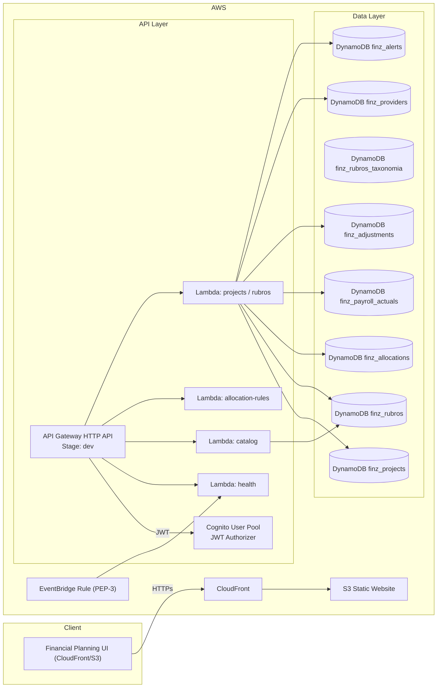

# AWS Components Diagram

```mermaid
flowchart LR
  subgraph Client
    UI["Financial Planning UI (CloudFront/S3)"]
  end

  subgraph AWS
    CF[CloudFront] --> S3[S3 Static Website]
    UI -->|HTTPs| CF

    subgraph API[API Layer]
      APIGW["API Gateway HTTP API<br/>Stage: dev"]
      COG["Cognito User Pool<br/>JWT Authorizer"]
      L1[Lambda: health]
      L2[Lambda: catalog]
      L3[Lambda: allocation-rules]
      L4[Lambda: projects / rubros]
    end

    subgraph Data[Data Layer]
      D1[(DynamoDB finz_projects)]
      D2[(DynamoDB finz_rubros)]
      D3[(DynamoDB finz_rubros_taxonomia)]
      D4[(DynamoDB finz_allocations)]
      D5[(DynamoDB finz_payroll_actuals)]
      D6[(DynamoDB finz_adjustments)]
      D7[(DynamoDB finz_providers)]
      D8[(DynamoDB finz_alerts)]
    end

    EVB["EventBridge Rule (PEP-3)"] --> L1
    APIGW -->|JWT| COG
    APIGW --> L1 & L2 & L3 & L4
    L4 --> D1 & D2 & D4 & D5 & D6 & D7 & D8
    L2 --> D2
  end
```

Notes:

- CORS allowlist includes <https://d7t9x3j66yd8k.cloudfront.net>
- All AWS actions in CI use OIDC to assume a role, no static keys.
