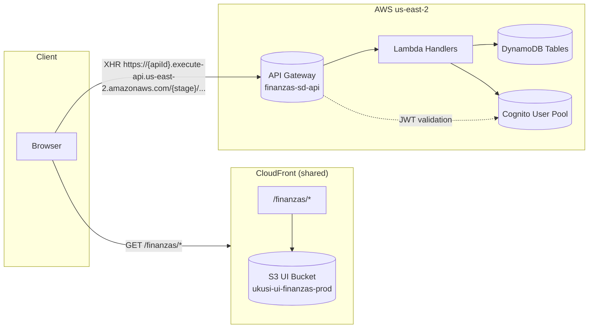

# Finanzas SD — Architecture

## Overview

The Finanzas Service Delivery (SD) module is a full-stack financial planning application consisting of:

- **UI**: React SPA hosted at `/finanzas/*` on CloudFront (backed by S3)
- **API**: Independent API Gateway in us-east-2 with Lambda handlers
- **Auth**: Cognito User Pool with JWT tokens, SDT group required
- **Data**: DynamoDB tables for projects, rubros, allocations, payroll, adjustments, alerts, providers, and audit logs

**Region**: us-east-2 for all backend components  
**CloudFront Domain**: https://d7t9x3j66yd8k.cloudfront.net  
**API Mode**: Mode A (direct calls from browser to API Gateway)

## Architecture Diagram



## Components

### Frontend (UI)

- **Technology**: React 18 + Vite + TypeScript
- **Path**: `/finanzas/*` on CloudFront distribution
- **S3 Bucket**: `ukusi-ui-finanzas-prod` (private, OAC-only access)
- **Distribution ID**: EPQU7PVDLQXUA
- **Base URL**: https://d7t9x3j66yd8k.cloudfront.net/finanzas/
- **Build Output**: `dist/` directory synced to S3 root

**Cache Strategy**:
- Hashed assets (JS/CSS): 1 year TTL, immutable
- HTML files: No cache, must-revalidate
- SPA routing: 403/404 → `/finanzas/index.html` (CloudFront custom error responses)

### Backend (API)

- **Technology**: AWS SAM (Serverless Application Model)
- **API Gateway**: HTTP API with Cognito JWT authorizer
- **Region**: us-east-2
- **Handlers**: Node.js Lambda functions (14 total: 5 implemented, 9 stubbed)
- **Stack Name**: `finanzas-sd-api-dev` (dev), `finanzas-sd-api-prod` (prod)

**Endpoints** (MVP implemented):
- `GET /health` - Health check (public)
- `GET /catalog/rubros` - Budget line items catalog (public)
- `POST /projects` - Create project (authenticated)
- `GET /projects` - List projects (authenticated)
- `POST /projects/{id}/handoff` - Project handoff with audit trail (authenticated)

**Endpoints** (R1 stubbed, returns 501):
- Project budget line items: `POST/GET /projects/{id}/rubros`
- Bulk allocations: `PUT /projects/{id}/allocations:bulk`
- Financial plan: `GET /projects/{id}/plan?mes=YYYY-MM`
- Payroll ingestion: `POST /payroll/ingest`
- Month close: `POST /close-month?mes=YYYY-MM`
- Budget adjustments: `POST/GET /adjustments`
- Alerts: `GET /alerts`
- Providers: `POST/GET /providers`
- Pre-invoice webhook: `POST/GET /prefacturas/webhook`

### Data Layer

**DynamoDB Tables**:
- `projects` - Project metadata and lifecycle
- `rubros` - Budget line items (catalog and project-specific)
- `allocations` - Resource allocations per project
- `payroll_actuals` - Actual payroll data
- `adjustments` - Budget adjustments and revisions
- `alerts` - Active alerts (PEP-3, budget overruns)
- `providers` - Vendor/provider master data
- `audit_log` - Audit trail for all mutations

**Access Pattern**: Lambda handlers use AWS SDK v3 with DynamoDB DocumentClient

## Auth & RBAC

### Authentication Flow

1. User authenticates with Cognito User Pool (login page)
2. Cognito issues JWT with `cognito:groups` claim
3. Browser stores JWT in local storage or session storage
4. XHR requests include `Authorization: Bearer <jwt>` header
5. API Gateway validates JWT signature against Cognito public keys
6. Lambda handler checks `event.requestContext.authorizer.jwt.claims['cognito:groups']` includes `SDT`

### Authorization

- **Public Endpoints**: `/health`, `/catalog/rubros` (no auth required)
- **Authenticated Endpoints**: All others require valid JWT
- **SDT Group**: Required for all authenticated endpoints (checked in handler logic)

**Cognito Configuration**:
- User Pool ID: (configured via SAM parameter `CognitoUserPoolId`)
- User Pool ARN: (configured via SAM parameter `CognitoUserPoolArn`)
- Group: `SDT` (Service Delivery Team)

## CORS

### Configuration

CORS is configured in API Gateway to allow requests from the CloudFront distribution:

- **Allow Origin**: `https://d7t9x3j66yd8k.cloudfront.net`
- **Allow Methods**: `GET`, `POST`, `PUT`, `OPTIONS`
- **Allow Headers**: `Authorization`, `Content-Type`
- **Max Age**: 300 seconds (preflight cache)

**Implementation**: Defined in SAM template under `Cors` property for HTTP API

### Preflight Requests

Browser automatically sends `OPTIONS` request for cross-origin requests. API Gateway responds with CORS headers:

```
Access-Control-Allow-Origin: https://d7t9x3j66yd8k.cloudfront.net
Access-Control-Allow-Methods: GET, POST, PUT, OPTIONS
Access-Control-Allow-Headers: Authorization, Content-Type
```

## Observability

### CloudWatch Metrics

**API Gateway Metrics**:
- `4XXError` - Client errors (target: <1%)
- `5XXError` - Server errors (target: <0.5%)
- `Count` - Total requests
- `IntegrationLatency` - Lambda execution time (target: p95 <500ms)
- `Latency` - End-to-end latency (target: p99 <1s)

**Lambda Metrics**:
- `Invocations` - Total invocations per handler
- `Errors` - Unhandled exceptions
- `Duration` - Execution time (target: p95 <300ms)
- `Throttles` - Concurrent execution limit hits

**DynamoDB Metrics**:
- `ConsumedReadCapacityUnits` - Read throughput
- `ConsumedWriteCapacityUnits` - Write throughput
- `UserErrors` - Client-side errors (ValidationException, etc.)
- `SystemErrors` - DynamoDB service errors

### CloudWatch Dashboards

Create custom dashboard with:
- API Gateway latency (p95, p99)
- API Gateway error rates (4xx, 5xx)
- Lambda invocations and errors per handler
- DynamoDB read/write capacity utilization

**Dashboard Name**: `finanzas-sd-api-{stage}`

### CloudWatch Alarms

**Critical Alarms**:
- `5xxError` > 0.5% over 5 minutes → SNS alert
- `Lambda Errors` > 5 over 5 minutes → SNS alert
- `DynamoDB SystemErrors` > 0 over 1 minute → SNS alert

**Warning Alarms**:
- `4xxError` > 5% over 10 minutes → SNS alert
- `IntegrationLatency` p99 > 1s over 10 minutes → SNS alert

### Logs

**Log Format**: JSON structured logs for easy parsing

```json
{
  "timestamp": "2025-11-03T01:18:05.378Z",
  "level": "INFO",
  "requestId": "abc123",
  "handler": "createProject",
  "userId": "user123",
  "message": "Project created successfully",
  "projectId": "proj456"
}
```

**Log Retention**: 7 days for dev, 30 days for prod

**Log Groups**:
- `/aws/lambda/finanzas-sd-api-{stage}-{handler}` (per Lambda)
- `/aws/apigateway/finanzas-sd-api-{stage}` (API Gateway access logs)

## Optional: Mode B (CloudFront Proxy)

### Overview

Mode B is an optional future enhancement where CloudFront proxies API requests instead of direct browser-to-API Gateway calls.

**Path**: `/api/finanzas/*` → API Gateway origin

**Benefits**:
- Unified domain for UI and API (no CORS needed)
- CloudFront caching for GET endpoints (catalog, read-only data)
- Custom headers for authentication (hide API Gateway URL from client)

**Implementation**:
- CloudFront behavior: `/api/finanzas/*` with API Gateway origin
- Origin policy: Forward `Authorization` header, strip others
- Cache policy: Cache GET requests by query string, no-cache for POST/PUT

**Status**: Deferred until Mode A stabilizes. Revisit if:
- CORS becomes problematic (browser extensions, enterprise proxies)
- Caching needed for read-heavy endpoints
- Single-domain requirement emerges

## Deployment Strategy

### UI Deployment

1. **Build**: `npm run build` (Vite bundles to `dist/`)
2. **Sync to S3**: `aws s3 sync dist/ s3://ukusi-ui-finanzas-prod/ --delete`
3. **Invalidate CloudFront**: `aws cloudfront create-invalidation --distribution-id EPQU7PVDLQXUA --paths "/finanzas/*"`
4. **Verification**: Smoke test `/finanzas/` and deep-link routes

**Automation**: GitHub Actions workflow `.github/workflows/deploy.yml`

### API Deployment

1. **Build**: `sam build` (packages Lambda code)
2. **Deploy**: `sam deploy --stack-name finanzas-sd-api-{stage} --parameter-overrides ...`
3. **Output**: API Gateway URL from CloudFormation outputs
4. **Verification**: Smoke test `/health` and `/catalog/rubros`

**Automation**: GitHub Actions workflow `.github/workflows/deploy-api.yml`

### Rollback

See [Operational Runbook](../ops/runbook-finanzas.md) for detailed rollback procedures.

## Security Considerations

### API Gateway

- **Throttling**: 1000 requests/second per API (burst: 2000)
- **WAF**: (Optional) AWS WAF rules to block malicious traffic
- **TLS**: HTTPS only, TLS 1.2+
- **Authentication**: Cognito JWT validation on every request

### Lambda

- **Least Privilege IAM**: Each Lambda has minimal permissions (DynamoDB table access only)
- **Environment Variables**: Secrets (if any) stored in AWS Secrets Manager, referenced via ARN
- **VPC**: (Optional) Deploy in VPC for private DynamoDB access (not currently implemented)

### DynamoDB

- **Encryption**: Encryption at rest (AWS managed KMS key)
- **Backups**: Point-in-time recovery enabled
- **Access**: IAM policies restrict access to Lambda execution roles only

### S3

- **Private Bucket**: No public access, CloudFront OAC only
- **Encryption**: AES256 server-side encryption
- **Versioning**: Enabled (90-day lifecycle for old versions)

## References

- [ADR-0002: Separate API Gateway per business domain](../adr/ADR-0002-separate-api-gateway-finanzas.md)
- [Operational Runbook](../ops/runbook-finanzas.md)
- [API Contracts](../api-contracts.md)
- [Authentication Usage](../auth-usage.md)
- [Deployment Guide](../deploy.md)
- Repository: `services/finanzas-api/` (SAM template and handlers)
