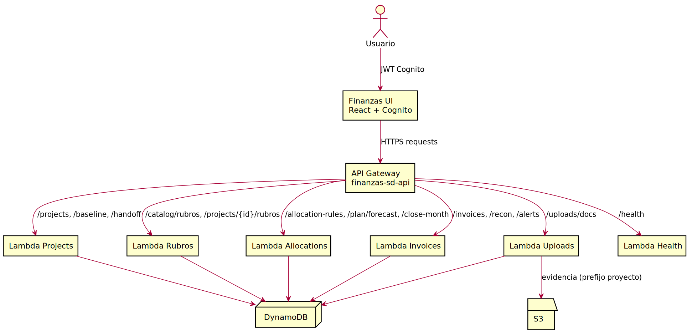

# Finanzas SD – API reference (Finanzas-only)

Base URL (dev): `https://pyorjw6lbe.execute-api.us-east-2.amazonaws.com/dev`

Authentication: JWT Cognito con grupos (`PMO`, `FIN`, `SDMT`, `AUDIT`, `EXEC_RO`). Todas las llamadas requieren header `Authorization: Bearer <token>`.

## Core endpoints
| Path | Method(s) | Purpose / Notas | Roles típicos |
| --- | --- | --- | --- |
| `/health` | GET | Prueba de disponibilidad y dependencias críticas. | `AUDIT`, `EXEC_RO` |
| `/projects` | GET, POST | Listar y crear proyectos con moneda, fechas y owner. | `PMO`, `FIN` |
| `/projects/{projectId}` | GET, PUT | Consultar/actualizar metadatos de proyecto. | `PMO`, `FIN` |
| `/baseline` | POST | Crear baseline inicial del proyecto. | `PMO` |
| `/baseline/{baseline_id}` | GET, PUT, DELETE | Gestionar versiones de baseline. | `PMO`, `FIN` |
| `/projects/{projectId}/handoff` | GET, POST | Exportar/registrar handoff hacia SDMT con rubros aprobados. | `PMO`, `SDMT` |
| `/handoff/{handoffId}` | GET | Recuperar handoff previo. | `SDMT`, `AUDIT` |
| `/catalog/rubros` | GET | Consultar catálogo maestro de rubros. | `PMO`, `FIN`, `SDMT` |
| `/projects/{projectId}/rubros` | GET, POST | Asociar rubros de catálogo a proyecto. | `PMO`, `FIN` |
| `/projects/{projectId}/rubros/{rubroId}` | DELETE | Eliminar asociación de rubro en proyecto. | `PMO`, `FIN` |
| `/line-items` | GET | Consultar line items filtrando por proyecto y rubro. | `PMO`, `FIN`, `SDMT` |
| `/allocation-rules` | GET | Leer reglas de asignación por proyecto. | `PMO`, `FIN` |
| `/projects/{id}/allocations:bulk` | POST | Cargar reglas de asignación en lote para un proyecto. | `PMO`, `FIN` |
| `/projects/{id}/plan` | GET | Obtener plan/forecast vigente por proyecto. | `PMO`, `FIN`, `SDMT` |
| `/plan/forecast` | POST | Recalcular forecast mensual a partir de reglas y line items. | `FIN`, `SDMT` |
| `/close-month` | POST | Consolidar cierre mensual y marcar periodos cerrados. | `FIN` |
| `/projects/{projectId}/invoices` | GET, POST | Registrar y consultar facturas con relación a line items. | `FIN` |
| `/projects/{projectId}/invoices/{invoiceId}` | GET, PUT | Actualizar metadata de factura. | `FIN` |
| `/projects/{projectId}/invoices/{invoiceId}/status` | PUT | Cambiar estado (draft/ready/approved/rejected). | `FIN`, `AUDIT` |
| `/uploads/docs` | POST | Subir evidencia (facturas, soporte de línea) con metadatos de proyecto. | `PMO`, `FIN`, `AUDIT` |
| `/recon` | GET | Conciliación: estado de facturas vs forecast. | `FIN`, `SDMT` |
| `/alerts` | GET | Alertas de desviación y auditoría. | `FIN`, `AUDIT` |

## Request/response notes
- Usa `Content-Type: application/json`; cargas de `uploads/docs` se envían como JSON con metadata y URL pre-firmada.
- Idempotencia recomendada para cargas en lote mediante `requestId` en headers.
- Errores devuelven `message`, `requestId`, y `statusCode`; evitar exponer datos sensibles.

## Availability
- Tiempo objetivo: 99.5% uptime; `/health` debe revisarse antes de despliegues.
- Latencia típica < 1s para operaciones de lectura; escrituras dependen de DynamoDB en `us-east-2`.
