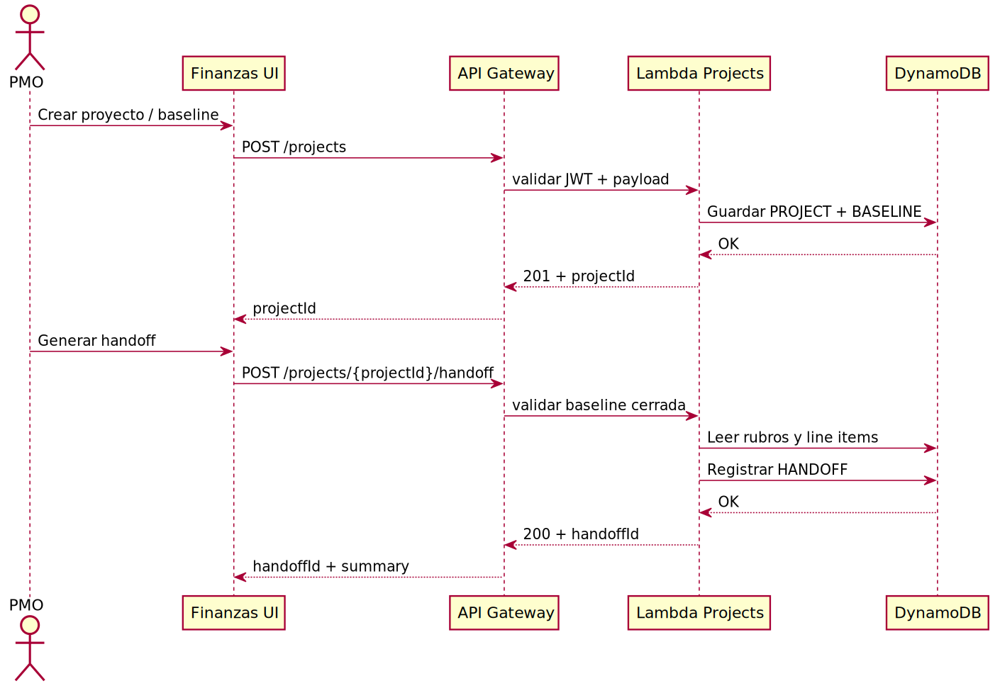
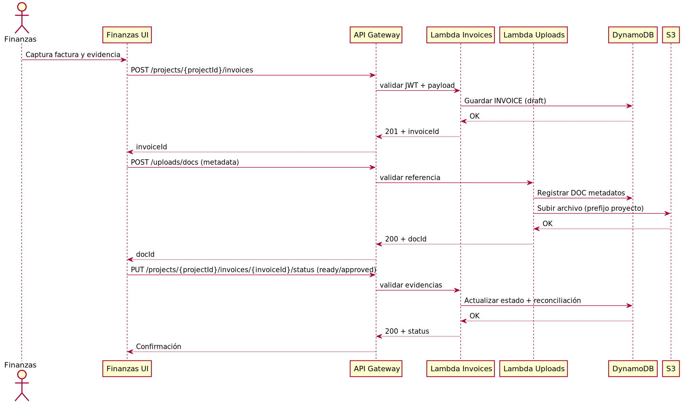

# Finanzas SD – Sequence diagrams / Diagramas de secuencia

## Project intake to SDMT handoff

- Flujo: PMO crea proyecto → define baseline → asocia rubros → genera handoff para SDMT.

## Invoice reconciliation with evidence

- Flujo: Finanzas registra factura → adjunta evidencia → reconcilia contra forecast → actualiza estado.

## Notes / Notas
- Todos los pasos requieren JWT con grupo habilitado; fallas de auth responden 401/403.
- La UI usa loaders optimistas, pero la confirmación depende de la respuesta de API.
