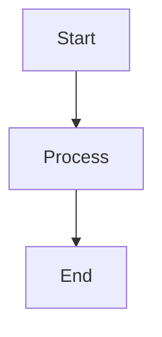

# Bilingual Documentation Pipeline

## Overview

This directory contains the documentation rendering pipeline for the Finanzas SD project. The pipeline automatically converts documentation sources (Markdown, Mermaid diagrams) into professional PDF and DOCX formats with bilingual (Spanish/English) content and corporate branding.

## Features

- **Dual-format Output**: Generates both PDF and DOCX files from source documentation
- **Bilingual Support**: Preserves both Spanish and English content with proper encoding
- **Corporate Branding**: Supports CVDex and Ikusi branding (configurable via environment variable)
- **High-Quality Diagram Rendering**: Converts Mermaid (.mmd) diagrams to SVG with 2x scaling for crisp visuals
- **Professional Styling**: Branded cover pages, headers, footers, and consistent typography
- **Index Generation**: Creates navigable index.html for easy document and diagram access
- **Diagram Validation**: Pre-flight syntax checking for Mermaid diagrams
- **Comprehensive Diagrams**: Includes system architecture, end-to-end flows, and role matrices

## Directory Structure

```
scripts/docs/
├── render-docs.ts        # Main rendering script
├── validate-diagrams.sh  # Diagram syntax validation script
├── tsconfig.json         # TypeScript configuration
└── README.md             # This file

docs/                      # Source Markdown documentation
├── architecture/          # Architecture documentation
├── sops/                  # Standard Operating Procedures
└── ...                    # Other documentation folders

diagrams/                  # Diagram source files
├── system-architecture.mmd       # System architecture diagram
├── end-to-end-flow.mmd          # Complete flow with user roles
├── roles-and-responsibilities.mmd # Role access matrix
├── *.mmd                         # Other Mermaid diagrams
├── *.drawio                      # Draw.io diagrams (manual export needed)
└── *.svg                         # SVG images

assets/
├── logo/                  # Brand logos
│   ├── cvdex-logo.svg
│   └── ikusi-logo.svg
└── branding/              # Templates and styles
    ├── template.tex       # LaTeX PDF template
    ├── reference.docx     # DOCX reference template (to be created)
    └── styles.css         # CSS for HTML output

public/docs/latest/        # Generated output (committed to repo)
├── index.html             # Navigation index
├── *.svg                  # Generated diagram SVGs
├── *.pdf                  # Generated PDF files
└── *.docx                 # Generated DOCX files
```

## Prerequisites

### Local Development
- Node.js >= 18.18
- npm >= 9
- Pandoc >= 2.x (for document conversion)
- LaTeX distribution (for PDF generation)
  - On Ubuntu/Debian: `sudo apt-get install texlive-xetex texlive-fonts-recommended texlive-latex-extra`
  - On macOS: `brew install pandoc basictex`
  - On Windows: Install MiKTeX or TeX Live

### GitHub Actions
All prerequisites are automatically installed by the workflow.

## Usage

### Local Execution

1. **Install dependencies:**
   ```bash
   npm ci
   ```

2. **Validate diagrams (optional but recommended):**
   ```bash
   ./scripts/docs/validate-diagrams.sh
   ```

3. **Run with default branding (Ikusi):**
   ```bash
   npm run render-docs
   ```

4. **Run with CVDex branding:**
   ```bash
   USE_CVDEX_BRANDING=true npm run render-docs
   ```

### GitHub Actions Execution

1. **Navigate to Actions tab** in the GitHub repository
2. **Select "Documentation Generator - Bilingual Pipeline"**
3. **Click "Run workflow"**
4. **Select the branch** (must be `main`)
5. **Click "Run workflow"** to start

The workflow will:
- Validate diagram syntax
- Install all required tools
- Process documentation and diagrams with high-quality rendering
- Generate PDF and DOCX files
- Deploy generated diagrams to output directory
- Commit outputs to `public/docs/latest/`
- Create downloadable artifacts

## Configuration

### Environment Variables

- `USE_CVDEX_BRANDING`: Set to `true` for CVDex branding, `false` or unset for Ikusi branding (default)

To configure in GitHub Actions:
1. Go to Repository Settings → Secrets and variables → Variables
2. Add a new variable `USE_CVDEX_BRANDING` with value `true` or `false`

### Branding Customization

#### Logos
Replace logo files in `assets/logo/`:
- `cvdex-logo.svg` - CVDex brand logo
- `ikusi-logo.svg` - Ikusi brand logo

Recommended format: SVG (scalable) or PNG (high resolution)
Recommended size: 400x100px or similar aspect ratio

#### PDF Template
Edit `assets/branding/template.tex` to customize:
- Cover page layout
- Header/footer content and styling
- Fonts and colors
- Page geometry

#### DOCX Template
Create/edit `assets/branding/reference.docx`:
1. Create a Word document with desired styles
2. Define header with logo
3. Define footer with page numbers
4. Set heading styles and body text formatting
5. Save as `reference.docx`

## Writing Documentation

### Markdown Files

Place Markdown files in the `docs/` directory with appropriate subdirectories:

```markdown
# Document Title

**English Title / Título en Español**

---

## EN: Section in English

Content in English...

## ES: Sección en Español

Contenido en español...

---
```

### Diagram Files

#### Mermaid Diagrams

Create `.mmd` files in the `diagrams/` directory:



**Diagram Quality Settings:**
- 2x scale rendering for high resolution
- Custom theme with professional colors
- Optimized spacing and layout (80px node spacing, 80px rank spacing)
- Support for bilingual labels using `<br/>` for line breaks
- Emojis supported in node labels (🔐, 🌐, etc.)

Diagrams are automatically converted to SVG during rendering and copied to the output directory.

**Existing High-Quality Diagrams:**
- `system-architecture.mmd` - Layered system architecture with all components
- `end-to-end-flow.mmd` - Complete user flow showing all roles and interactions  
- `roles-and-responsibilities.mmd` - Role-based access control matrix

#### Draw.io Diagrams

For Draw.io diagrams:
1. Create diagram in diagrams.net (draw.io)
2. Save as `.drawio` file in `diagrams/` directory
3. **Manually export to SVG** (File → Export as → SVG)
4. Reference the SVG in your Markdown

### Referencing Diagrams

In Markdown files, reference diagrams using relative paths:

```markdown

```

## Output Files

Generated files are stored in `public/docs/latest/`:

- `index.html` - Navigation index listing all documents
- `{document-name}.pdf` - PDF version of each document
- `{document-name}.docx` - DOCX version of each document

### Accessing Documentation

1. **Via Repository**: Browse to `public/docs/latest/` in GitHub
2. **Via Index**: Open `public/docs/latest/index.html` in a browser
3. **Via Artifacts**: Download from GitHub Actions workflow artifacts

## Troubleshooting

### Pandoc Not Found

**Error**: `Pandoc is not installed`

**Solution**: Install Pandoc:
- Ubuntu/Debian: `sudo apt-get install pandoc texlive-xetex`
- macOS: `brew install pandoc`
- Windows: Download from https://pandoc.org/installing.html

### Mermaid Rendering Fails

**Error**: `Failed to convert Mermaid diagram`

**Solution**: 
- Ensure Chromium/Chrome is installed
- Set PUPPETEER_EXECUTABLE_PATH environment variable
- Check Mermaid syntax using `./scripts/docs/validate-diagrams.sh`
- Verify diagram file is not empty
- Check for unbalanced brackets or parentheses

### Unicode/Encoding Issues

**Error**: Special characters appear as "�"

**Solution**:
- Ensure all source files are UTF-8 encoded
- Verify LaTeX supports UTF-8 (xelatex engine)
- Check font packages are installed

### PDF Generation Fails

**Error**: LaTeX errors during PDF generation

**Solution**:
- Install complete LaTeX distribution
- Check template.tex for syntax errors
- Verify logo paths are correct

### No Documents Generated

**Error**: Output directory is empty

**Solution**:
- Verify Markdown files exist in `docs/` directory
- Check console output for specific errors
- Ensure Pandoc and tools are properly installed

## Security & Compliance

- **No Secrets**: Pipeline does not require AWS credentials or secrets
- **OIDC Ready**: If cloud access is needed, uses GitHub OIDC (not implemented yet)
- **Scope Limited**: Only modifies `public/docs/latest/` directory
- **Audit Trail**: Git commits provide version history for all documentation changes

## Maintenance

### Adding New Document Types

To support additional file formats:

1. Add file type to `findFiles()` function in `render-docs.ts`
2. Implement conversion function (similar to `convertMermaidToSVG()`)
3. Update processing logic in `main()` function
4. Test locally before committing

### Updating Dependencies

```bash
# Update Mermaid CLI
npm install -g @mermaid-js/mermaid-cli@latest

# Update TypeScript dependencies
npm update ts-node typescript @types/node
```

### Regular Reviews

- **Quarterly**: Review generated documentation quality
- **Biannually**: Update branding assets if needed
- **Annually**: Review and update templates

## Support

For issues or questions:
1. Check this README and troubleshooting section
2. Review GitHub Actions logs for specific errors
3. Open an issue in the repository with error details

## License

Internal use only - Confidential
